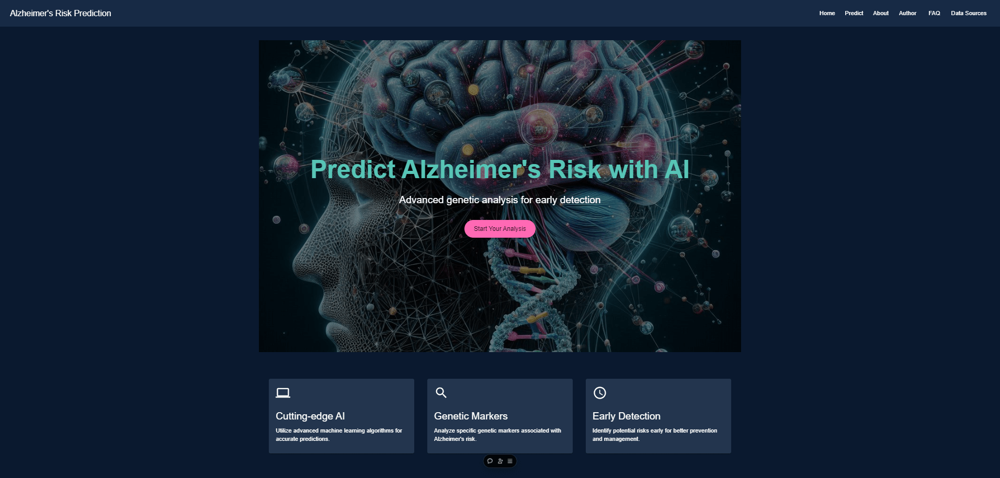
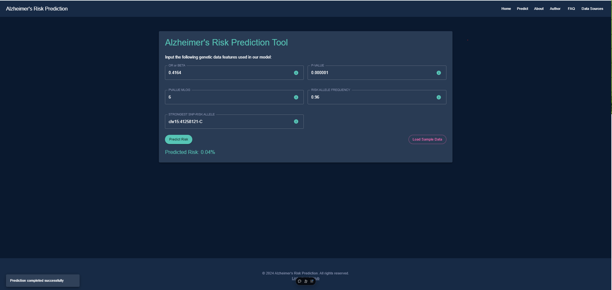

# Alzheimer's Risk Prediction using Machine Learning

[](LICENSE)

## Table of Contents

1. [Project Overview](#project-overview)
2. [Features](#features)
3. [Tech Stack](#tech-stack)
4. [Live Demo](#live-demo)
5. [Installation and Setup](#installation-and-setup)
   - [Backend Setup](#backend-setup)
   - [Frontend Setup](#frontend-setup)
6. [Running the Application](#running-the-application)
   - [Running the Backend](#running-the-backend)
   - [Running the Frontend](#running-the-frontend)
7. [API Endpoints](#api-endpoints)
   - [POST /predict](#post-predict)
   - [GET /feature_importance](#get-feature_importance)
8. [GWAS Dataset Documentation](#gwas-dataset-documentation)
9. [Model Details](#model-details)
10. [File Structure](#file-structure)
11. [Future Work](#future-work)
12. [Contributing](#contributing)
13. [License](#license)
14. [Contact Author](#contact-author)


## Project Overview

**Alzheimer's Risk Prediction using Machine Learning** is a web application that predicts an individual's risk of developing Alzheimer's disease based on genetic factors. Leveraging advanced machine learning techniques and interactive visualizations, the app provides users with valuable insights into their genetic predisposition.

**Goal of the App**: To empower individuals and healthcare professionals with predictive analytics for early detection and prevention strategies related to Alzheimer's disease.



**Live Demo**: You can try out the application here:

👉 **[Alzheimer's Risk Prediction App](https://alzheimerspredictionfrontend-fbwful15c-sam-boesens-projects.vercel.app/)** 👈

## Features

- **Risk Prediction**: Input genetic data to receive a personalized risk percentage.
- **SHAP Value Explanation**: Visualize feature importance using SHAP (SHapley Additive exPlanations) values.
- **Risk Breakdown**: Detailed analysis of how each genetic factor contributes to the overall risk.

## Tech Stack

- **Frontend**:
  - [React](https://reactjs.org/)
  - [Material-UI](https://material-ui.com/)
- **Backend**:
  - [Flask](https://flask.palletsprojects.com/)
  - [Python](https://www.python.org/)
  - [XGBoost](https://xgboost.readthedocs.io/)
  - [Google Cloud Storage](https://cloud.google.com/storage)
- **Deployment**:
  - [Vercel](https://vercel.com/) (Frontend)
  - [Google Cloud Run](https://cloud.google.com/run) (Backend)
- **Containerization**:
  - [Docker](https://www.docker.com/)

## Live Demo

Experience the application live without any setup:

👉 **[Alzheimer's Risk Prediction App](https://alzheimerspredictionfrontend-fbwful15c-sam-boesens-projects.vercel.app/)** 👈

## Installation and Setup

If you'd like to run the application locally or explore the code further, follow these instructions.

### Backend Setup

#### Prerequisites

- **Python 3.8+**
- **pip** package manager
- **Google Cloud Account** (for accessing the machine learning model)
- **Git**

### Frontend Setup

#### Prerequisites

- **Node.js v14+**
- **npm or yarn** package manager
- **Google Cloud Account** (for accessing the machine learning model)
- **Git**

#### Steps

1. **Clone the Repository**

   ```bash
   git clone https://github.com/sboesen2/Alzheimers-Prediction-with-Machine-Learning.git
   cd alzheimers-risk-prediction/backend
   
2. **Create a Virtual Environment**

   ```bash
   python -m venv venv
   source venv/bin/activate  # On Windows: venv\Scripts\activate

3. **Install depndecies**

   ```bash
   pip install -r requirements.txt

4. **Set Environment Variables**

   ```bash
   export GOOGLE_APPLICATION_CREDENTIALS="/path/to/your/service-account-key.json"
   export BUCKET_NAME="your-google-cloud-bucket-name"
   export PIPELINE_FILENAME="your_risk_model.joblib"
   export LOCAL_PIPELINE_PATH="/app/models/your_risk_model.joblib"

5. **Start the Backend server**

   ```bash
   flask run --host=0.0.0.0 --port=8080

**Note**:

- Replace `/path/to/your/service-account-key.json` with the actual path to your Google Cloud service account key JSON file.
- Update `your-google-cloud-bucket-name` with the name of your Google Cloud Storage bucket.
- Ensure that the `your_risk_model.joblib` file is correctly placed in the specified `LOCAL_PIPELINE_PATH`.

### Running the Application

### Running the Backend

#### Without Docker

If you want to test Backend locally without using Docker you can do so using tools like:
- **cURL**: A command-line tool for transferring data with URLs. It's typically pre-installed on Unix-based systems. [Download cURL](https://curl.se/download.html) if it's not available.
- **Postman**: A graphical tool for API development. [Download Postman](https://www.postman.com/downloads/) if you prefer a GUI.

 #### With Docker

When you are ready to deploy you should use a Docker image to containerize the application

1. **Build the Docker image**

   ```bash
   docker build -t alzheimers-backend .

2. **Run the Docker container**

   ```bash
   docker run -p 8080:8080 \
   e GOOGLE_APPLICATION_CREDENTIALS="/app/credentials/service-account-key.json" \
   v /path/to/your/service-account-key.json:/app/credentials/service-account-key.json \
   alzheimers-backend

### Running the Frontend

The frontend for this web application was deployed on vercel which will explained below. It is also important to note that local testing is often an important part of the devlopment process as well so that will be documnented also:

#### Without Docker

If you prefer to run the frontend locally without using Docker, follow these steps:

1. **Navigate to the Frontend Directory**

   Ensure you're in the `frontend` directory of the project.

   ```bash
   cd frontend

2. **Install depnedencies**

   ```bash
   npm install
   # or
   yarn install

3. **Configure Environment Variables**

   Create a .env file in the frontend directory to store environment variables.

   ```bash
   Copy code
   touch .env
   
   # Open the .env file in your preferred text editor and add the following

   env
   Copy code
   REACT_APP_BACKEND_URL="http://localhost:8080"

 Note: Replace http://localhost:8080 with the actual URL of your backend server if it's hosted elsewhere.
 This is really only usefull during local testing and devlopment. Cloud deployment should be done 
 using docker


#### Deploying the Frontend via Vercel

While running the frontend locally is essential for development and testing, deploying it to a cloud platform like Vercel ensures scalability, reliability, and easy access for users. Vercel is an excellent choice for deploying React applications due to its seamless integration and automatic optimizations.

Here’s a quick guide to deploying your frontend application on Vercel:

1. **Prerequisites**

   - **Vercel Account**: If you don't have one, sign up for free at [Vercel](https://vercel.com/signup).
   - **GitHub Repository**: Ensure your frontend code is pushed to a GitHub repository. Vercel integrates seamlessly with GitHub for continuous deployments.

2. **Connect Your GitHub Repository to Vercel**

   1. **Login to Vercel**

      Navigate to [Vercel](https://vercel.com/) and log in to your account.

   2. **Import Project**

      - Click on the **"New Project"** button.
      - Select **"Import Git Repository"**.
      - Choose the GitHub repository containing your frontend code. If prompted, authorize Vercel to access your GitHub account.

3. **Configure Project Settings**

   During the import process, Vercel will auto-detect the framework (e.g., React). Review and configure the following settings:

   - **Framework Preset**: Ensure it correctly identifies your framework (e.g., React).
   - **Build Command**: Typically, `npm run build` or `yarn build`.
   - **Output Directory**: Usually `build` for React applications.

4. **Set Environment Variables**

   Environment variables are crucial for connecting the frontend to the backend. To set them up:

   1. **Navigate to Project Settings**

      After importing the project, go to your project dashboard on Vercel and click on **"Settings"**.

   2. **Add Environment Variables**

      - Click on **"Environment Variables"** in the sidebar.
      - Add the following variables:

        | Name                   | Value                         |
        |------------------------|-------------------------------|
        | `REACT_APP_BACKEND_URL` | `https://your-backend-url.com` |

      **Note**: Replace `https://your-backend-url.com` with the actual URL of your deployed backend server.

5. **Deploy the Project**

   - After configuring the settings and environment variables, click on **"Deploy"**.
   - Vercel will start building and deploying your project. This process may take a few minutes.
   - Once deployed, Vercel provides a live URL for your application, typically in the format `https://your-project-name.vercel.app/`.

6. **Enable Automatic Deployments**

   Vercel supports automatic deployments, meaning every time you push changes to the connected GitHub repository, Vercel will automatically rebuild and deploy the updated frontend.

   **Benefits**:
   - **Continuous Integration**: Ensures that your live application is always up-to-date with the latest code changes.
   - **Easy Rollbacks**: If a deployment introduces issues, Vercel allows you to rollback to previous deployments effortlessly.

7. **Accessing Your Deployed Application**

   Once the deployment is complete, you can access your live frontend application via the URL provided by Vercel (e.g., `https://your-project-name.vercel.app/`).

8. **Optional: Configure a Custom Domain**

   If you have a custom domain, you can link it to your Vercel project for a more professional appearance.

   1. **Add Domain in Vercel**

      - In your project dashboard on Vercel, navigate to the **"Domains"** section.
      - Click on **"Add"** and enter your custom domain name.

   2. **Update DNS Settings**

      - Vercel will provide DNS records that you need to add to your domain registrar.
      - Follow the instructions to update your DNS settings accordingly.

   3. **Verify Domain**

      - After updating DNS settings, Vercel will verify the domain. This may take some time depending on DNS propagation.

#### Quick Setup Summary

1. **Push your frontend code to GitHub.**
2. **Connect your GitHub repository to Vercel.**
3. **Configure build settings and environment variables in Vercel.**
4. **Deploy the project and access it via the provided URL.**

**Note**: This guide provides a high-level overview. For more detailed instructions, refer to the [Vercel Documentation](https://vercel.com/docs).

## API Endpoints

### POST `/predict`

**Description**: Accepts genetic data and returns a predicted Alzheimer's risk percentage.

- **Request URL**: `http://localhost:8080/predict`

- **Request Headers**: Body and Response

  ```http
  Content-Type: application/json

   {
  "snpRiskAllele": "rs12345-A",
  "pValue": 0.001,
  "orBeta": 1.5,
  "riskAlleleFrequency": 0.3,
  "pValueMlog": 3.0
   }
  
  {
  "risk": 78.5,
  "timestamp": "2024-10-14T12:00:00Z"
  }

### GET `/feature_importance`

**Description**: Returns data used to visualize feature importance via SHAP values.

- **Request URL**: `http://localhost:8080/feature_importance`

```json
{
  "feature_importance": {
    "snpRiskAllele": 0.4,
    "pValue": 0.3,
    "orBeta": 0.2,
    "riskAlleleFrequency": 0.1,
    "pValueMlog": 0.05
  }
}

```
# GWAS Dataset Documentation

Welcome to the comprehensive documentation for the Genome-Wide Association Studies (GWAS) dataset. This README provides an in-depth overview of the dataset, including detailed explanations of each column, a sample data entry for illustration, and guidance on how to interpret the information. Whether you're a researcher, data scientist, or enthusiast, this guide will help you navigate and utilize the dataset effectively.

---

## Introduction

Genome-Wide Association Studies (GWAS) are pivotal in understanding the genetic basis of complex diseases and traits. This dataset compiles results from various GWAS, providing valuable insights into the associations between genetic variants and specific phenotypes. This documentation serves as a comprehensive guide to understanding and utilizing the dataset effectively.

## Dataset Description

The GWAS dataset encompasses a wide range of studies investigating the genetic underpinnings of various diseases and traits. Each entry in the dataset corresponds to a specific genetic variant (Single Nucleotide Polymorphism or SNP) associated with a particular trait or disease. The dataset includes detailed metadata from the studies, such as sample sizes, genomic locations, statistical significance, and biological implications.

### Key Features

- **Comprehensive Coverage:** Includes multiple studies across different diseases and traits.
- **Detailed Metadata:** Each SNP is annotated with extensive information, facilitating in-depth analysis.
- **Sample and Replication Data:** Provides both initial and replication sample sizes for robust validation.
- **Genomic Context:** Information on chromosomal locations, gene mappings, and variant types.
- **Statistical Significance:** P-values and effect sizes to assess the strength of associations.

## Column Definitions

Understanding each column is crucial for effectively utilizing the dataset. Below is a detailed explanation of each column included in the dataset:

| **Column Name**                  | **Description**                                                                                                                                                        |
|----------------------------------|------------------------------------------------------------------------------------------------------------------------------------------------------------------------|
| **DATE ADDED TO CATALOG**        | The date when the entry was added to the catalog.                                                                                                                      |
| **PUBMEDID**                     | PubMed identifier for the study.                                                                                                                                         |
| **FIRST AUTHOR**                 | The first author of the study.                                                                                                                                           |
| **DATE**                         | The publication date of the study.                                                                                                                                       |
| **JOURNAL**                      | The journal where the study was published.                                                                                                                                |
| **LINK**                         | URL link to the study's PubMed page.                                                                                                                                    |
| **STUDY**                        | Title of the study.                                                                                                                                                      |
| **DISEASE/TRAIT**                | The disease or trait investigated in the study.                                                                                                                          |
| **INITIAL SAMPLE SIZE**          | Description of the initial sample size, including demographics.                                                                                                           |
| **REPLICATION SAMPLE SIZE**      | Sample size used for replication, if applicable.                                                                                                                         |
| **REGION**                       | Chromosomal region where the SNP is located.                                                                                                                             |
| **CHR_ID**                       | Chromosome identifier.                                                                                                                                                   |
| **CHR_POS**                      | Chromosomal position of the SNP.                                                                                                                                            |
| **REPORTED GENE(S)**             | Genes reported in association with the SNP.                                                                                                                                |
| **MAPPED_GENE**                  | Genes mapped to the SNP.                                                                                                                                                  |
| **UPSTREAM_GENE_ID**             | Gene ID upstream of the SNP.                                                                                                                                                |
| **DOWNSTREAM_GENE_ID**           | Gene ID downstream of the SNP.                                                                                                                                              |
| **SNP_GENE_IDS**                 | Associated gene IDs for the SNP.                                                                                                                                           |
| **UPSTREAM_GENE_DISTANCE**       | Distance to the upstream gene (in base pairs).                                                                                                                            |
| **DOWNSTREAM_GENE_DISTANCE**     | Distance to the downstream gene (in base pairs).                                                                                                                          |
| **STRONGEST SNP-RISK ALLELE**    | The SNP with the strongest association and its risk allele.                                                                                                              |
| **SNPS**                         | SNP identifier(s).                                                                                                                                                       |
| **MERGED**                       | Indicator if the SNP has been merged with other SNPs.                                                                                                                     |
| **SNP_ID_CURRENT**               | Current identifier for the SNP.                                                                                                                                           |
| **CONTEXT**                      | Contextual information about the SNP variant.                                                                                                                              |
| **INTERGENIC**                   | Indicates if the SNP is intergenic (located between genes).                                                                                                               |
| **RISK ALLELE FREQUENCY**        | Frequency of the risk allele in the population.                                                                                                                           |
| **P-VALUE**                      | P-value indicating the statistical significance of the association.                                                                                                       |
| **PVALUE_MLOG**                  | -log10 transformed P-value for easier interpretation of significance levels.                                                                                            |
| **P-VALUE (TEXT)**               | P-value represented in text format.                                                                                                                                       |
| **OR or BETA**                   | Odds Ratio (OR) or Beta coefficient indicating the effect size of the SNP.                                                                                               |
| **95% CI (TEXT)**                | 95% Confidence Interval for the OR or Beta.                                                                                                                              |
| **PLATFORM [SNPS PASSING QC]**    | Genotyping platform used and the number of SNPs passing Quality Control (QC).                                                                                            |
| **CNV**                          | Copy Number Variation information, if applicable.                                                                                                                          |
| **MAPPED_TRAIT**                 | Standardized trait mapped to the study's phenotype.                                                                                                                       |
| **MAPPED_TRAIT_URI**             | URI link to the standardized trait definition.                                                                                                                            |
| **STUDY ACCESSION**              | Accession number for the study in the GWAS catalog.                                                                                                                      |
| **GENOTYPING TECHNOLOGY**        | Technology used for genotyping in the study.                                                                                                                              |
| **Gene_Key**                     | Key identifier for the gene involved.                                                                                                                                      |
| **Entry**                        | Entry identifier in the database.                                                                                                                                          |
| **Reviewed**                     | Indicator if the entry has been reviewed.                                                                                                                                    |
| **Entry Name**                   | Name of the entry in the database.                                                                                                                                          |
| **Protein names**                | Proteins encoded by the mapped gene(s).                                                                                                                                     |
| **Gene Names**                   | Official names of the genes involved.                                                                                                                                      |
| **Organism**                     | Organism studied (e.g., Homo sapiens).                                                                                                                                     |
| **Length**                       | Length of the gene or genomic region.                                                                                                                                      |
| **Involvement in disease**       | Description of how the gene is involved in the disease.                                                                                                                   |
| **Sequence_y**                   | Additional sequence information related to the SNP or gene.                                                                                                               |

## Sample Data

To illustrate the structure and content of the dataset, below is a subset of a sample entry:

| DATE ADDED TO CATALOG | PUBMEDID | FIRST AUTHOR | DATE      | JOURNAL | LINK                                                        | STUDY                                                                                                                                           | DISEASE/TRAIT                    | INITIAL SAMPLE SIZE                                                                                                                                                             | REPLICATION SAMPLE SIZE | REGION | CHR_ID | CHR_POS  | REPORTED GENE(S) | MAPPED_GENE      | UPSTREAM_GENE_ID | DOWNSTREAM_GENE_ID | SNP_GENE_IDS | UPSTREAM_GENE_DISTANCE | DOWNSTREAM_GENE_DISTANCE | STRONGEST SNP-RISK ALLELE | SNPS       | MERGED | SNP_ID_CURRENT | CONTEXT            | INTERGENIC | RISK ALLELE FREQUENCY | P-VALUE | PVALUE_MLOG | P-VALUE (TEXT) | OR or BETA | 95% CI (TEXT)          | PLATFORM [SNPS PASSING QC]     | CNV | MAPPED_TRAIT                | MAPPED_TRAIT_URI                              | STUDY ACCESSION | GENOTYPING TECHNOLOGY      | Gene_Key        | Entry  | Reviewed | Entry Name | Protein names | Gene Names    | Organism | Length | Involvement in disease | Sequence_y |
|-----------------------|----------|--------------|-----------|---------|------------------------------------------------------------|-------------------------------------------------------------------------------------------------------------------------------------------------|----------------------------------|---------------------------------------------------------------------------------------------------------------------------------------------------------------------------------|-------------------------|--------|--------|----------|-------------------|-------------------|-------------------|---------------------|--------------|------------------------|--------------------------|----------------------------|------------|--------|-----------------|--------------------|------------|-----------------------|---------|-------------|-----------------|------------|------------------------|---------------------------------|-----|-----------------------------|----------------------------------------------|-----------------|-----------------------------|-----------------|--------|----------|------------|---------------|---------------|----------|--------|------------------------|------------|
| 6/16/2016             | 26268530 | Ramanan VK   | 8/11/2015 | Brain   | [Link](https://www.ncbi.nlm.nih.gov/pubmed/26268530)       | GWAS of longitudinal amyloid accumulation on 18F-florbetapir PET in Alzheimer's disease implicates microglial activation gene IL1RAP.               | Longitudinal change in brain amyloid plaque burden | "41 European ancestry Alzheimer's disease cases, 294 European ancestry Mild Cognitive Impairment cases, 160 European ancestry cognitively normal individuals" | Unknown                 | 1q44  | 1      | 244753317 | intergenic       | C1orf202 - COX20   | ENSG00000284188    | ENSG00000203667      | Unknown      | 22302                  | 82299                    | rs7534801-?                | rs7534801 | 0      | 7534801         | intergenic_variant | 1          | 0.21                  | 3e-06   | 5.5229      | 5.522878745280337 | Unknown    | [0.29-0.73] unit decrease | Illumina [6112217] (imputed) | N   | amyloid plaque accumulation rate | [EFO_0007646](http://www.ebi.ac.uk/efo/EFO_0007646) | GCST003082      | Genome-wide genotyping array | C1orf202 - COX20 | Unknown | Unknown  | Unknown    | Unknown       | Unknown_Gene  | Unknown  | -1     | Unknown                | Unknown    |

### Sample Entry Breakdown

Let's dissect the sample entry to understand the dataset's structure and the meaning of each field.

- **Study Information:**
  - **PubMed ID:** 26268530
  - **First Author:** Ramanan VK
  - **Publication Date:** August 11, 2015
  - **Journal:** Brain
  - **Study Title:** GWAS of longitudinal amyloid accumulation on 18F-florbetapir PET in Alzheimer's disease implicates microglial activation gene IL1RAP.
  - **Link:** [PubMed Study](https://www.ncbi.nlm.nih.gov/pubmed/26268530)

- **Trait and Samples:**
  - **Disease/Trait:** Longitudinal change in brain amyloid plaque burden
  - **Initial Sample Size:** 41 European ancestry Alzheimer's disease cases, 294 European ancestry Mild Cognitive Impairment cases, 160 European ancestry cognitively normal individuals
  - **Replication Sample Size:** Unknown

- **Genetic Variant Details:**
  - **Chromosomal Location:** Chromosome 1q44 at position 244,753,317
  - **Reported Gene:** Intergenic region near C1orf202 - COX20
  - **Mapped Gene:** C1orf202 - COX20
  - **SNP Identifier:** rs7534801
  - **Variant Type:** Intergenic variant
  - **Risk Allele Frequency:** 0.21
  - **P-Value:** 3e-06 (M-log P-Value: 5.5229)
  - **Effect Size:** OR or Beta is Unknown with a 95% CI of [0.29-0.73] unit decrease
  - **Genotyping Platform:** Illumina [6112217] (imputed)

- **Additional Information:**
  - **Mapped Trait URI:** [EFO_0007646](http://www.ebi.ac.uk/efo/EFO_0007646)
  - **Study Accession:** GCST003082
  - **Organism:** Unknown
  - **Sequence Information:** Unknown

This entry illustrates how each SNP is associated with a specific trait, providing details about its genomic context, statistical significance, and potential biological implications.

## Model Details

This section provides a comprehensive overview of the machine learning model developed to predict the risk of Alzheimer's disease based on GWAS data. The model leverages an XGBoost classifier within a robust preprocessing pipeline to handle various data types and ensure optimal performance.



### Model Architecture

- **Type of Model:** XGBoost Classifier
- **Preprocessing Pipeline:**
  - **Numeric Features:**
    - **Features:** `P-VALUE`, `OR or BETA`, `PVALUE_MLOG`
    - **Imputation:** Missing values are imputed using the mean strategy.
    - **Scaling:** Features are standardized using `StandardScaler`.
  - **Categorical Features:**
    - **Features:** `STRONGEST SNP-RISK ALLELE`
    - **Imputation:** Missing values are filled with the constant value `'missing'`.
    - **Encoding:** Categorical variables are encoded using `OneHotEncoder` with `handle_unknown='ignore'`.
  - **Special Numeric Features:**
    - **Features:** `RISK ALLELE FREQUENCY`
    - **Imputation:** Missing values (originally marked as `'NR'`) are filled with `-1`.
    - **Scaling:** Features are standardized using `StandardScaler`.
- **Classifier:**
  - **Algorithm:** XGBoost (`XGBClassifier`)
  - **Parameters:**
    - `eval_metric='logloss'`
    - `random_state=42`

### Hyperparameters

The model utilizes a range of hyperparameters tuned using `RandomizedSearchCV` to optimize performance. Below are the hyperparameters considered and their selected values:

| **Hyperparameter**            | **Values Explored**          | **Selected Value**          |
|-------------------------------|------------------------------|------------------------------|
| `classifier__n_estimators`    | [100, 200, 300]              | *Best value from search*     |
| `classifier__max_depth`       | [3, 4, 5]                     | *Best value from search*     |
| `classifier__learning_rate`   | [0.01, 0.1, 0.2]              | *Best value from search*     |
| `classifier__subsample`       | [0.8, 0.9, 1.0]               | *Best value from search*     |
| `classifier__colsample_bytree` | [0.8, 0.9, 1.0]               | *Best value from search*     |
| `classifier__scale_pos_weight` | [Calculated based on class weights] | *Best value from search*     |

**Hyperparameter Tuning Process:**

- **Method:** Randomized Search with Cross-Validation
- **Number of Iterations:** 10
- **Cross-Validation Strategy:** 5-fold cross-validation
- **Random State:** 42 for reproducibility
- **Number of Jobs:** -1 (utilizes all available processors)

### Training Process

1. **Data Loading:**
   - The dataset is loaded from a CSV file located at:
     ```
     C:\Your\File\Location
     ```

2. **Target Variable Creation:**
   - A binary target variable `is_alzheimers` is created by checking if the `MAPPED_TRAIT` column contains the substring `'Alzheimer'`.

3. **Feature Selection:**
   - Selected features for the model:
     - `STRONGEST SNP-RISK ALLELE`
     - `P-VALUE`
     - `OR or BETA`
     - `RISK ALLELE FREQUENCY`
     - `PVALUE_MLOG`

4. **Data Cleaning:**
   - The `RISK ALLELE FREQUENCY` column contains `'NR'` values, which are replaced with `NaN` and then converted to numeric, coercing errors to `NaN`.

5. **Preprocessing:**
   - **Numeric Features:** Imputed with mean and scaled.
   - **Categorical Features:** Imputed with `'missing'` and one-hot encoded.
   - **Special Numeric Features (`RISK ALLELE FREQUENCY`):** Imputed with `-1` and scaled.

6. **Pipeline Construction:**
   - A `Pipeline` is created combining the preprocessing steps and the XGBoost classifier.

7. **Data Splitting:**
   - The dataset is split into training and testing sets with an 80-20 split using `train_test_split` with `random_state=42` for reproducibility.

8. **Class Weight Calculation:**
   - Class weights are calculated to address any class imbalance in the target variable.

9. **Hyperparameter Tuning:**
   - `RandomizedSearchCV` is used to explore the hyperparameter space and identify the best combination of parameters based on cross-validation performance.

10. **Model Training:**
    - The best estimator from the randomized search is fitted on the training data.

### Evaluation Metrics

The model's performance is evaluated using the following metrics:

- **Classification Report:** Provides precision, recall, F1-score, and support for each class.
- **Confusion Matrix:** Shows the number of true positives, true negatives, false positives, and false negatives.
- **ROC-AUC Score:** Measures the model's ability to distinguish between classes.
- **Cross-Validation ROC-AUC Scores:** Assesses the model's performance across different folds to ensure consistency.

**Sample Evaluation Output:**


## Usage Examples

Below are examples of how you can utilize the GWAS dataset in your research or projects.

### Loading the Dataset

```python
import pandas as pd

# Load the dataset
gwas_data = pd.read_csv('path_to_gwas_dataset.csv')

# Display the first few rows
print(gwas_data.head())


```
## File Structure

The project is organized into several key directories and files to maintain a clean and efficient workflow. Below is an overview of the directory structure:

```plaintext
Alzheimers-Prediction-with-Machine-Learning/
├── backend/
├── frontend/
├── Notebooks/
├── LICENSE
├── README.md
└── .gitignore


---
```

### **Explanation of the Sections:**

1. **File Structure**:
   - **Plaintext Directory Tree**: Provides a visual representation of the project's main directories and files.

2. **Directory Breakdown**:
   - **backend/**:
     - **Description**: Offers a high-level overview of what the backend directory contains and its role in the project.
   - **frontend/**:
     - **Description**: Details the contents and purpose of the frontend directory, highlighting its connection to Vercel and the backend.
   - **Notebooks/**:
     - **Description**: Explains the purpose of the Jupyter notebooks within the project, emphasizing their role in data analysis and model evaluation.
   - **LICENSE**:
     - **Description**: Mentions the licensing of the project.
   - **README.md**:
     - **Description**: Indicates that this documentation file provides an overview and instructions.
   - **.gitignore**:
     - **Description**: States the purpose of the gitignore file in managing version control.

3. **Additional Notes**:
   - **Customization**: Encourages users to adjust the descriptions to better fit their actual project structure.
   - **Sensitive Information**: Reminds users to handle sensitive data securely.

---

### **Customization Tips:**

- **Accurate Descriptions**: Make sure the descriptions for each directory accurately reflect their contents and roles within your project.
  
- **Additional Directories**: If your project contains other directories (e.g., `docs/`, `scripts/`, `tests/`), consider adding them with appropriate descriptions.

- **Visual Enhancements**: You can enhance the directory tree with more detailed subdirectories if needed, but since this is a high-level overview, the current structure should suffice.

## Future Work

While significant progress has been made in developing and deploying the Alzheimer's risk prediction model, there are several areas where further enhancements can be made. As a junior in college, I recognize my current limitations in software and web development. I welcome contributions and suggestions from the community to help address these challenges and improve the project. Below are the key areas for future development:

1. **Advanced Model Interpretability**
    - **SHAP Values and Explainability:**
        - **Current Status:** I have explored using SHAP values and other explainability tools to interpret the model's predictions. However, I was unable to integrate these visualizations into the production environment.
        - **Desired Enhancement:** Implement interactive SHAP value visualizations within the web application to provide users with deeper insights into feature importance and model decisions.
        - **How You Can Help:** Assistance with deploying SHAP explanations on the frontend, integrating explainable AI libraries, or developing interactive plots.

2. **API Enhancements**
    - **Current Status:** The existing API is simple and functional but lacks advanced features and scalability.
    - **Desired Enhancement:** Develop a more robust API with endpoints for model interpretability, batch predictions, and real-time updates.
    - **How You Can Help:** Expertise in API development using frameworks like FastAPI or Flask, optimizing API performance, and adding new endpoints.

3. **User Interface Improvements**
    - **Current Status:** The frontend is basic and may not provide the best user experience.
    - **Desired Enhancement:** Enhance the user interface with better design, responsive layouts, and additional functionalities such as interactive dashboards.
    - **How You Can Help:** Frontend development skills using React, Vue, or other modern frameworks; UI/UX design expertise; and experience with visualization libraries like D3.js or Plotly.

4. **Feature Expansion**
    - **Current Status:** Limited to current features; additional features could provide more value to users.
    - **Desired Enhancement:** Incorporate more GWAS data, additional predictive features, and integrate other machine learning models for comparison.
    - **How You Can Help:** Data engineering, feature engineering, and machine learning expertise to expand the feature set and explore alternative models.

5. **Deployment and Scalability**
    - **Current Status:** Deployment is basic and may not handle high traffic or large-scale data efficiently.
    - **Desired Enhancement:** Improve the deployment strategy to ensure scalability, reliability, and security. Consider containerization, cloud deployment, and load balancing.
    - **How You Can Help:** Knowledge in DevOps, cloud platforms (AWS, GCP, Azure), Docker, Kubernetes, and CI/CD pipelines.

6. **Documentation and Testing**
    - **Current Status:** Documentation is comprehensive, but testing coverage can be improved.
    - **Desired Enhancement:** Develop thorough unit and integration tests to ensure code reliability and maintainability.
    - **How You Can Help:** Experience in writing automated tests, setting up testing frameworks, and enhancing documentation with more examples and tutorials.

7. **Community Engagement**
    - **Current Status:** Limited community involvement and user feedback.
    - **Desired Enhancement:** Foster a community around the project to gather feedback, encourage contributions, and facilitate collaboration.
    - **How You Can Help:** Promote the project on social media, write blog posts, organize webinars or workshops, and engage with contributors.

## Contributing

I appreciate your interest in contributing to the **Alzheimer's Risk Prediction using Machine Learning** project! Your contributions help enhance the project, improve its functionality, and ensure its continued success. Below are the guidelines and steps to help you get started.

### How to Contribute

If you're interested in helping improve the project, feel free to open issues, submit pull requests, or reach out directly. Your contributions, no matter how small, can make a significant difference in advancing this project.


#### Reporting Issues

If you encounter any bugs or have ideas for improvements, please [open an issue](https://github.com/sboesen2/Alzheimers-Prediction-with-Machine-Learning/issues) in the repository. When reporting an issue, please include:

- A clear and descriptive title.
- A detailed description of the problem or suggestion.
- Steps to reproduce the issue, if applicable.
- Any relevant screenshots or logs.

#### Suggesting Enhancements

I welcome suggestions for new features or enhancements. To propose an improvement:

1. Open an issue in the repository.
2. Provide a clear and descriptive title.
3. Outline the proposed changes and their benefits.
4. Include any relevant examples or references.

#### Submitting Pull Requests

Pull requests (PRs) are the best way to propose changes to the project. By submitting a PR, you are suggesting modifications and additions to the codebase.

1. **Ensure the project is up-to-date**: Sync your fork with the latest changes from the main repository to avoid merge conflicts.
2. **Follow the development workflow**: Refer to the [Development Workflow](#development-workflow) section below.
3. **Provide a clear description**: In your PR, describe what changes you have made and why they are necessary.
4. **Reference issues**: If your PR addresses an existing issue, mention it by including `Closes #issue_number` in your PR description.

### Development Workflow

Follow these steps to contribute effectively:

#### Fork the Repository

1. Navigate to the [Alzheimer's Risk Prediction](https://github.com/sboesen2/Alzheimers-Prediction-with-Machine-Learning) repository on GitHub.
2. Click the **Fork** button at the top right to create your own fork of the project.

#### Clone Your Fork

Clone the forked repository to your local machine using Git:

```bash
git clone https://github.com/yourusername/Alzheimers-Prediction-with-Machine-Learning.git
cd Alzheimers-Prediction-with-Machine-Learning

```
#### Create a new branch

```bash
git checkout -b feature/your-feature-name

```
#### Commit your changes
```bash
git add .
git commit -m "Add feature: Brief description of your feature"

```
#### Push toyour fork

```bash
git push origin feature/your-feature-name

```
#### Open a pull request
1. Navigate to your forked repository on GitHub.
2. Click the Compare & pull request button.
3. Provide a clear title and description for your PR.
4. Submit the pull request for review.

### Testing

- **Write Tests**: Ensure that new features and bug fixes include appropriate tests.
- **Run Tests**: Before submitting a PR, run all tests to ensure they pass.

### Documentation

- **Update README**: If your changes affect the usage or functionality of the project, update the `README.md` accordingly.
- **Inline Documentation**: Add comments and docstrings to explain complex logic and functionalities within the code.

### Style Guides

Adhering to style guides ensures consistency and improves code quality. Follow the guidelines below based on the programming language you are using.

#### Python

- **PEP 8**: Follow the [PEP 8](https://pep8.org/) style guide for Python code.
- **Docstrings**: Use docstrings to document modules, classes, and functions.

    ```python
    def calculate_risk(data):
        """
        Calculate Alzheimer's risk based on genetic data.
        
        Parameters:
            data (dict): Genetic data input.
        
        Returns:
            float: Predicted risk percentage.
        """
        pass
    ```

#### JavaScript

- **ESLint**: Use [ESLint](https://eslint.org/) to maintain consistent coding standards.
- **Prettier**: Integrate [Prettier](https://prettier.io/) for automatic code formatting.

    ```javascript
    // Example of a well-documented function
    /**
     * Calculates the feature importance using SHAP values.
     *
     * @param {Object} data - The input data.
     * @returns {Object} - The feature importance scores.
     */
    function calculateFeatureImportance(data) {
        // Function implementation
    }
    ```

### Acknowledgments

- **Inspiration**: Think of good inspirations

## License

This project is licensed under the MIT License - see the [LICENSE](LICENSE) file for details.

### Data Licensing
All data was obtained from reputable, publicly available sources including:

- **UniProt Data:** Licensed under [UniProt Terms of Use](https://www.uniprot.org/help/license).
- **ProteomicsDB Data:** Licensed under [ProteomicsDB Terms of Use](https://www.proteomicsdb.org/about/terms).
- **GWAS Catalog Data:** Licensed under [GWAS Catalog Terms](https://www.ebi.ac.uk/gwas/docs/terms-and-conditions).
- **STRING Database Data:** Licensed under [STRING License](https://string-db.org/cgi/help?sessionId=).

## Contact Author

For any questions, suggestions, or feedback, please contact the author:

- **Name**: Sam Boesen
- **Email**: sam.boesen2@gmail.com
- **GitHub**: [sboesen2](https://github.com/sboesen2)
  

